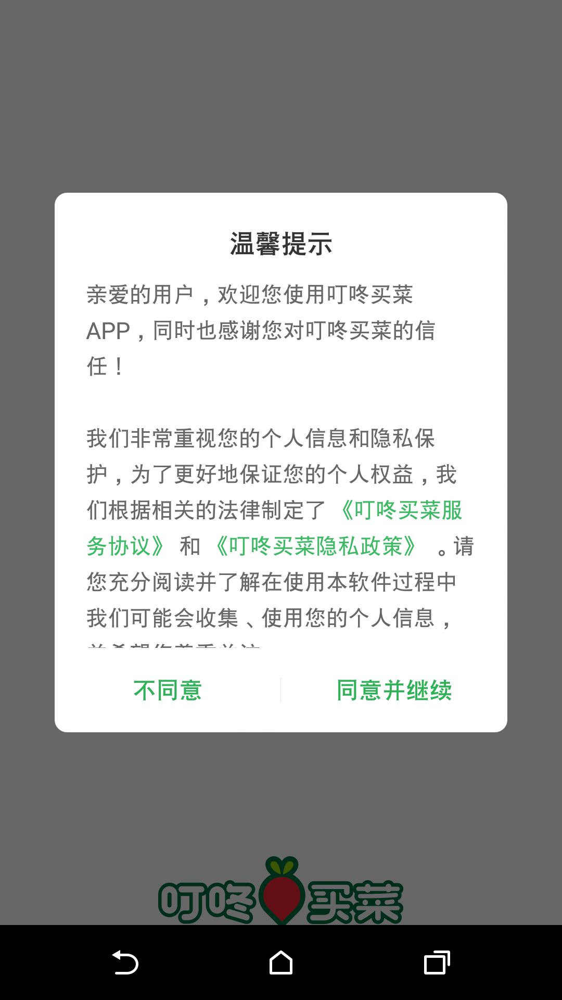

## 目的
一个使用python操作手机的demo例子，能够实现手机的点击，截屏操作。

## 环境配置
```bash
pip install pure-python-adb opencv-python numpy
```

## 使用
```bash
python run.py
```

adb支持的操作代码：

```
Input tap x y
Input text “hello world!”
Input keyevent eventID
Here is a list of some common eventID’s:
3: home button
4: back button
5: call
6: end call
24: volume up
25: volume down
26: turn device on or off
27: open camera
64: open browser
66: enter
67: backspace
207: contacts
220: brightness down
221: brightness up
277: cut
278: copy
279: paste
```